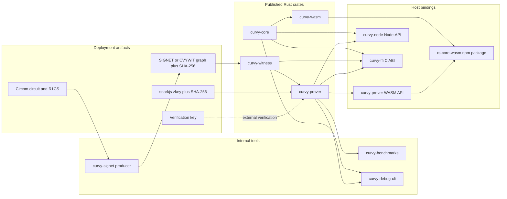
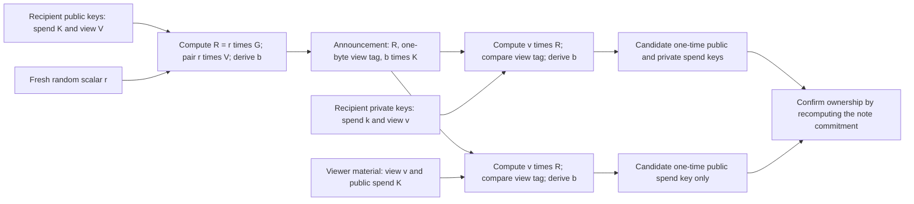
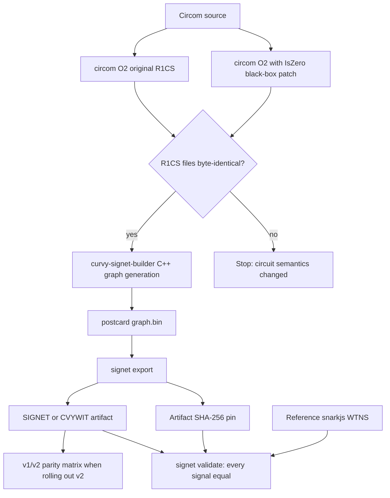
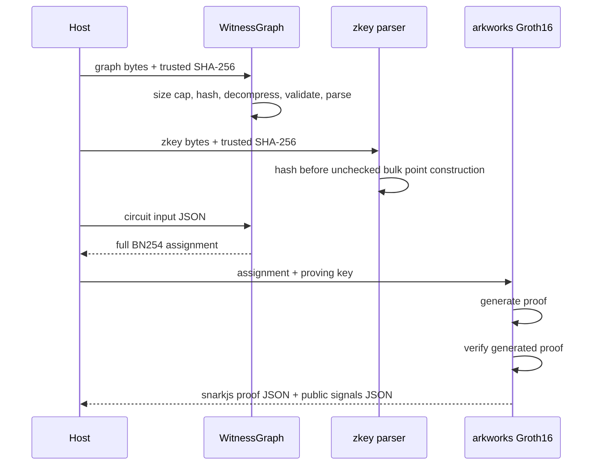

# `rs-core` knowledge handover

Current implementation and audit status: [6 September follow-up](SECURITY_PERFORMANCE_AUDIT.md). This document retains historical context and measurements.

This document is the maintainer-oriented introduction to `rs-core`. It is aimed
at a developer who has some knowledge of Rust but has not worked on this repository or on
Curvy's cryptographic stack before.

It describes the repository at `main` commit `e17b711` / tag
`v0.1.0-rc.5` (17 August 2026). Re-check the version, tag, CI configuration, and
release status when reading this after that revision.

## Executive summary

`rs-core` is Curvy's Rust implementation of three related layers:

1. protocol-compatible cryptography and note/tree state;
2. evaluation of precompiled Circom witness graphs; and
3. Groth16 proof generation from snarkjs proving keys.

The same implementation is exposed to Rust, browser/Node WebAssembly, native
Node.js, and C-compatible mobile/embedded hosts. Circuit source, proving keys,
verification keys, and deployment-specific witness graphs are **not** bundled
with the libraries. A deployment supplies a matching artifact set and trusted
SHA-256 pins.

The most important facts for a new maintainer are:

- Compatibility is part of correctness. Much of the core is a byte-for-byte
  port of existing TypeScript, Go, Circom, and snarkjs behavior. Committed golden
  vectors are protocol oracles, not ordinary tests that may be casually updated.
- There are two different BabyJubjub signing profiles. A seed-backed key and a
  direct scalar containing the same-looking number are different accounts. Do
  not convert between them implicitly.
- Artifact hashes are security boundaries. A hash sent beside untrusted bytes is
  not a trust anchor; expected digests must come from trusted deployment
  metadata.
- The normal prover loads the whole proving key. SPARROW is an opt-in,
  bounded-memory alternative. SPARROW and its SAGE evaluator are intentionally
  absent from default builds and from the normal WASM npm package.
- Plain `cargo build` and `cargo test` cover only the workspace's default members,
  `curvy-core` and `curvy-witness`. Use `--workspace --all-targets` for the real
  repository-wide check.
- Four Rust crates are publishable: `curvy-core`, `curvy-witness`,
  `curvy-prover`, and `curvy-wasm`. The SIGNET producer, bindings, benchmark
  tools, and debug CLI are not crates.io packages.
- Release automation is currently **disabled**. `.github/workflows/release.yml.disabled`
  documents an npm WASM workflow but GitHub does not run it. crates.io
  publication is also manual, and the native Node release has its own manual
  multi-platform staging script.
- The repository is release-candidate software. Internal dependency versions
  and downstream examples use exact pins intentionally.

## System at a glance



### What belongs here

- Protocol primitives: Poseidon, BabyJubjub EdDSA, note encryption and
  commitments, stealth addressing, and note-tree state.
- Circuit-input construction for withdrawal, aggregation, and pending-note
  commitment circuits.
- Authenticated parsing and evaluation of Curvy witness-graph artifacts.
- Parsing snarkjs `.zkey` and `.wtns` formats and producing snarkjs-compatible
  Groth16 proof/public-signal JSON.
- Native and WASM execution layers plus the C and Node boundaries.
- Internal generation, validation, benchmarking, and debugging tools for those
  layers.

### What does not belong here

- Curvy's Circom circuit source and production ceremony artifacts.
- Deployment-specific URLs or hashes.
- Product SDK orchestration and wallet/application business logic. JavaScript
  applications should normally consume `@0xcurvy/curvy-sdk`, not call the raw
  WASM package directly.
- A second implementation of BN254 arithmetic. The prover keeps field, group,
  randomness, and final Groth16 verification in arkworks.

## Repository map

The workspace uses Rust edition 2024 and Rust 1.94. All packages currently share
version `0.1.0-rc.5`.

| Path / package | Role | Published? | Start reading at |
|---|---|---:|---|
| `crates/core` / `curvy-core` | Crypto primitives, notes, witness-input builders, and Merkle state | crates.io | [`crates/core/src/lib.rs`](crates/core/src/lib.rs) |
| `crates/witness` / `curvy-witness` | Authenticated `curvy-graph-v1` parser and evaluator | crates.io | [`crates/witness/src/lib.rs`](crates/witness/src/lib.rs) |
| `crates/prover` / `curvy-prover` | zkey/WTNS parsing, Groth16 proving, native CLI, prover WASM, SPARROW | crates.io | [`crates/prover/src/lib.rs`](crates/prover/src/lib.rs) |
| `crates/wasm` / `curvy-wasm` | wasm-bindgen surface for `curvy-core` | crates.io; generated JS is published to npm | [`crates/wasm/src/lib.rs`](crates/wasm/src/lib.rs) |
| `crates/signet` / `curvy-signet` | Internal witness-graph producer, inspector, resealer, and validator | No | [`crates/signet/README.md`](crates/signet/README.md) |
| `bindings/ffi` / `curvy-ffi` | Maintained C ABI for mobile/embedded/native hosts | No crates.io package | [`bindings/ffi/README.md`](bindings/ffi/README.md) and [`bindings/ffi/include/curvy.h`](bindings/ffi/include/curvy.h) |
| `bindings/node` / `curvy-node` | Native Node-API backend binding | npm artifact, not crates.io | [`bindings/node/README.md`](bindings/node/README.md) |
| `bindings/wasm` | README/assets copied into the generated browser npm package | Generated npm content | [`bindings/wasm/README.md`](bindings/wasm/README.md) |
| `tools/benchmarks` / `curvy-benchmarks` | Non-published prover/SAGE/SPARROW measurements | No | [`crates/prover/BENCHMARKS.md`](crates/prover/BENCHMARKS.md) |
| `tools/debug-cli` / `curvy-debug-cli` | Interactive protocol and demo-prover REPL | No | [`tools/debug-cli/src/main.rs`](tools/debug-cli/src/main.rs) |

The separate `crates/signet/generator` Cargo project is deliberately not a
workspace member. It pins `curvy-signet-builder` and compiles one circuit into
the intermediate postcard `graph.bin`. A workspace build will not prove that
this separate generator still works; run its smoke script when changing that
pipeline.

Generated outputs under `target`, `dist`, `crates/*/pkg-*`, native `.node`
binaries, and `bindings/node/release` are ignored. Treat them as disposable
build products, never as source-of-truth files. `bindings/node/index.js` and
`index.d.ts`, the C header, `Cargo.lock`, and test vectors are intentionally
tracked.

## Mental model of the protocol core

The core source calls out two cryptographic domains. Keeping them mentally
separate makes reviews much easier.

### Domain A: stealth addressing

Domain A combines two curves:

- secp256k1 for spending keys; and
- BN254 G1/G2 plus a pairing for viewing keys and ephemeral announcements.

A sender derives an announcement containing an ephemeral BN254 point `R`, a
one-byte view tag, and a one-time secp256k1 spending public key. A recipient
scans announcements with its view key and derives the matching one-time public
and private spending keys. A view-only scanner can derive only the public key.



Important behavior:

- Points cross public string boundaries as `"X.Y"` decimal coordinates. Private
  stealth keys are big-endian hex.
- A view-tag match is only a candidate. One-byte tags produce false positives at
  about 1/256. The caller must confirm ownership by recomputing the note
  commitment.
- Malformed network announcements are skipped as non-matches; malformed caller
  keys are hard errors. One bad announcement must not abort a wallet scan.
- The mapping from gnark's pairing-tower component to arkworks is pinned by Go
  compatibility vectors. Do not “simplify” coordinate selection without
  re-establishing cross-language parity.
- `curvy-core/parallel` uses Rayon only to fan out independent scan entries.

The implementation is in [`crates/core/src/stealth.rs`](crates/core/src/stealth.rs).

### Domain B: circuit and commitment layer

Domain B uses the BN254 scalar field, BabyJubjub, Poseidon, the note cipher,
commitments, note trees, and circuit witness builders. This is where most code
and most normal application work lives.

| Area | What it does | Main module |
|---|---|---|
| Field boundary | BN254 `Fr`, canonical checked values, decimal and byte conversions | `field.rs` |
| Poseidon | circomlib-compatible arities 1 through 16 | `poseidon/` |
| BabyJubjub | Checked points/scalars, point addition, scalar multiplication | `babyjubjub.rs` |
| Signing | Seed-backed and direct-scalar EdDSA-Poseidon | `eddsa.rs` |
| Note cipher | AES-256-CTR-derived additive field pads | `cipher.rs` |
| Commitments | `ownerHash`, note `id`, and `nullifier` | `note.rs` |
| Trees | Flat, indexed, ordered, frontier, and sharded Poseidon Merkle trees | `imt.rs` |
| Circuit inputs | Withdrawal, aggregation, and pending-commitment inputs | `witness.rs` |

The three note hashes deliberately use fixed input order:

```text
ownerHash = Poseidon([ownerPub.x, ownerPub.y, sharedSecret])
noteId    = Poseidon([ownerHash, amount, token])
nullifier = Poseidon([sharedSecret, ownerPub.x, ownerPub.y])
```

Input order is protocol data. Changing it is a breaking cryptographic change.

### Boundary and encoding rules

Many apparent crypto bugs are actually boundary bugs. These are the rules to
keep visible during a review:

| Value | Public representation | Validation / behavior |
|---|---|---|
| Ordinary field value | Non-negative decimal string | `fr_from_dec` reduces modulo BN254 and panics on non-numeric internal input |
| Untrusted/persisted field value | Decimal or canonical 32-byte value | `Bn254Fr` / checked byte decoder rejects values outside the field |
| Bulk tree fields | Concatenated 32-byte big-endian canonical field elements | Used by WASM and C ABI to avoid one allocation/call per field |
| BabyJubjub secret scalar | Decimal or fixed 32-byte little-endian scalar | Must be non-zero and below the subgroup order |
| BabyJubjub checked point | Decimal `x`, `y` | Curve, prime subgroup, and identity policy are validated |
| Cipher / `sha256BigInt` integer | Raw decimal integer below `2^256` | Never field-reduced; packed big-endian |
| Seed-profile EdDSA message | Raw integer below `2^256` | Packed little-endian where required by the established EdDSA behavior |
| Stealth point | `"X.Y"` decimal string | Validated on the correct curve |
| Stealth private key / view tag | Hex | Private scalars reject zero reduction |

The core crate forbids unsafe Rust. Its low-level internal helpers assume that
the binding or checked type has already validated untrusted input; do not expose
panic-on-malformed helpers directly at a foreign boundary.

### The two BabyJubjub signing profiles

Both profiles are supported. Neither is a migration path for the other.

| Profile | Stored material | Derivation | Main APIs |
|---|---|---|---|
| Seed-backed | Exactly 32 unprefixed hex bytes | Original BLAKE-512, pruning/clamping, then Base8 multiplication | `SeedNoteSigner`, `pub_from_private_key_hex`, `sign_hex` |
| Direct-scalar | Canonical non-zero BabyJubjub subgroup scalar | Public key is directly `scalar * Base8` | `ScalarSigningKey`, `BabyJubSecretScalar`, `BabyJubPoint` |

The seed-backed implementation uses original BLAKE-512, not BLAKE2. Its EdDSA
response follows the deployed zk-kit behavior, which differs in one scalar
detail from circomlibjs. The tests preserve the deployed behavior.

Both signer objects implement `NoteSigner`, so witness builders obtain the
public key and signature from the same object. This prevents pairing a signature
with an unrelated public key. The older `build_withdrawal` and
`build_aggregation` functions retain the seed-backed profile for source
compatibility; new generic code can use the `_with_signer` variants.

### Note encryption is not authenticated encryption

The note's amount and token occupy two public field signals, so there is no
space for an AEAD tag or IV. The implementation derives two AES-256-CTR
keystream blocks and adds them into the BN254 field. Integrity comes from the
on-chain note ID. A decrypting caller **must** recompute the note ID and reject a
mismatch.

The established derivation is:

- AES key: HKDF-SHA256 over the big-endian shared secret;
- counter block: the first 16 bytes of SHA-256 over ephemeral `x || y`;
- counter mode: 64-bit big-endian counter, matching WebCrypto; and
- two 32-byte keystream slices reduced into the field and added/subtracted.

### Merkle state choices

Choose the narrowest tree that matches the state model:

| Type | Use it for | Key behavior |
|---|---|---|
| `Imt` | Low-level flat incremental tree / parity work | Retains the full tree; leaf-index access |
| `IndexedMerkleTree` | Notes/pending circuits that need reverse leaf lookup | Rejects duplicate leaves; proof by value or position; supports truncate |
| `OrderedMerkleTree` | Position-addressed public vectors such as fee tables | Allows duplicate values; proof by position |
| `NotesFrontier` | Append-only indexing and cheap per-block checkpoints | Constant space; no leaves or witnesses; emits a shard root at boundaries |
| `ShardedNotesTree` | Wallet note state | Keeps the live shard, completed shard roots, and paths only for owned notes |

Production notes-tree constants are depth 30, shard height 14, 16,384 leaves per
shard, and persisted-state schema version 1. The sharded root and proofs are
exactly equal to those of a flat zero-padded IMT.

`ShardedNotesTree` can mark owned notes, freeze their within-shard paths when a
shard completes, attach the current cap path on demand, drain dirty owned-note
records for persistence, and rewind the live shard for reorg handling. A
versioned snapshot stores only the state needed to restore it. Treat a snapshot
version bump as a storage migration.

`NotesFrontier` is even smaller: a depth-30 snapshot is at most about 1 KiB. Use
it where the service only needs a current root and completed shard descriptors,
not wallet witnesses.

### Circuit-input builders

`curvy-core::witness` builds flattened, snarkjs-shaped inputs but does not
evaluate Circom or prove them.

| Builder | Inputs / behavior | Signing or hash rule |
|---|---|---|
| Withdrawal | Notes, supplied inclusion proofs, destination, amount, token | Signs Poseidon over nullifiers plus destination/amount/token |
| Aggregation | Resolved and already-padded input/output notes and proofs | Signs Poseidon of output-note IDs and encrypted-note-data hash |
| Pending commitment | Mutates a clone of an indexed tree, pads the batch with zero slots | `sha256BigInt` over padded IDs, roots, and indices |

The pending builder skips insertion for zero padding slots and emits zero
siblings for them. The Node wrapper commits the cloned tree only after all
insertions, proofs, JSON construction, and input hashing succeed, so the
operation is transactional from JavaScript's point of view.

## Witness graphs and deployment artifacts

`curvy-witness` evaluates an offline-compiled graph; it is not a general Circom
runtime and has no Wasmer dependency.

### Accepted graph formats

A default build accepts:

- `SIGNET01` and legacy-compatible `CVYWIT01` envelopes;
- body version 1; and
- either raw bytes or one strict zstd frame.

Feature `signet-v2` additionally accepts the compact version-2 body, which uses
varint distances and ZigZag output deltas. The alias feature `signet` currently
means `signet-v2`. Version 2 remains opt-in so accepting a new deployment
artifact format is deliberate.

The parser checks the expected SHA-256 **before** parsing graph-controlled
counts, references, or field values. For compressed artifacts, the pin is the
digest of the compressed frame received by the parser, not the decompressed
body. It also rejects:

- excessive compressed or expanded sizes and zstd windows;
- dictionaries, multiple frames, skippable frames, or trailing data;
- invalid headers, versions, tags, references, mappings, and field values;
- non-canonical v2 integers and structural corruption;
- unknown JSON input names, wrong shapes, and oversized JSON; and
- assignments whose first signal is not one.

Omitted known Circom inputs remain zero. Unknown names are errors. Input names
are mapped through FNV-1a and collision handling is explicit.

### Resource profiles

Limits are selected at graph construction time:

| Profile | Intended host | Node ceiling | Raw graph ceiling | Approximate structural budget at maxima |
|---|---|---:|---:|---:|
| `Limits::client()` / default | Browser, wallet, ordinary client | 2,000,000 | 64 MiB | about 280 MiB plus allocator overhead |
| `Limits::batch_prover()` | Deliberate server-side large circuit | 8,000,000 | 96 MiB | about 799 MiB plus allocator overhead |

The client profile covers the currently documented largest published client
shape; the batch profile covers pending(50). Do not hand batch limits to a
browser simply to make a failing artifact load—the limits are a denial-of-service
boundary.

### Artifact generation pipeline



Build the intermediate graph from the circuits repository:

```bash
CIRCUITS_DIR=/path/to/packages/zk-circuits \
  crates/signet/scripts/build-graph.sh \
  path/inside/circuits/to/circuit.circom /tmp/circuit.graph.bin
```

The script requires `circom`, Cargo, a C++ toolchain, `patch`, `cmp`, the circuits
tree, and its `node_modules/circomlib`. It compiles original and patched R1CS at
`-O2` and refuses to continue unless they are byte-identical. It then vendors
the lockfile-pinned generator into a fresh scratch directory and prints the
generator version/checksum and R1CS digest. Record those values with the
artifact.

Generate graphs one at a time. Each C++ build can consume hundreds of megabytes
or more, and the isolated target directory is a correctness requirement: the
upstream build dependency does not declare `WITNESS_CPP` as a rerun input, so
reusing a target can silently reuse the previous circuit.

Export and validate:

```bash
cargo run --release -p curvy-signet -- export \
  /tmp/circuit.graph.bin artifacts/circuit.signet R1CS_SHA256

cargo run --release -p curvy-signet -- validate \
  artifacts/circuit.signet ARTIFACT_SHA256 input.json reference.wtns
```

Defaults are SIGNET envelope, version 1, and zstd level 9. Install system `zstd`
before publishing; the fallback encoder is valid but only level 1 and produces
larger output. The evaluator caps the zstd window at 8 MiB. Level 9 uses a 4 MiB
window and keeps safety headroom; raising compression levels and consumer limits
is a coordinated protocol/artifact change.

`signet export` round-trips the result through the production evaluator, but
that is not sufficient. `--ops patched|original` selects the operation enum
schema of the postcard producer. Choosing the wrong schema can still parse and
compute the wrong assignment. **Every export must be followed by exact parity
against a reference WTNS.**

The `Operation` declaration order in `crates/signet/src/postcard.rs` is wire
data because postcard serializes enum declaration indices. Never reorder it.
The stable operation tags in `curvy_witness::wire` are also append-only: never
renumber or reuse an existing tag.

For a SIGNET v2 rollout, run the deployment matrix over every accepted graph:

```bash
cargo run --release -p curvy-signet --example v2_parity_matrix -- \
  path/to/signet-v2-parity.json
```

The matrix independently encodes and evaluates v1 and v2 and records a canonical
assignment digest. Store its report with release metadata.

`signet reseal` can authenticate an existing graph, change only its eight-byte
envelope and/or compression, and verify the result. It cannot change body
version, fix a wrong operation schema, or change what the graph computes.

### Matching the complete proving bundle

A production bundle should pin together:

- graph bytes, length, SHA-256, format, R1CS provenance digest, and limits profile;
- zkey bytes, length, and SHA-256;
- verification key version or digest;
- R1CS digest and circuit dimensions;
- one known-good WTNS fixture/digest; and
- for SPARROW, a chunk manifest length, digest, chunk size, and per-chunk table.

Run the local bundle validator:

```bash
cargo run --release -p curvy-prover --example artifact_manifest_check -- \
  circuit.zkey circuit.signet circuit.wtns verification_key.json circuit.r1cs
```

This validates local parsing, every proving-key point, graph/zkey/WTNS dimensions,
R1CS provenance, and exact verification-key equality. It does **not** replace:

```bash
snarkjs zkey verify circuit.r1cs ceremony.ptau circuit.zkey
snarkjs wtns check circuit.r1cs circuit.wtns
```

Those upstream checks establish ceremony-transcript and constraint semantics.

`artifact_manifest_check` fully parses graph and WTNS bodies before emitting a
manifest. It accepts raw and zstd `SIGNET01`/`CVYWIT01` artifacts through the
common graph parser and reports metadata from the decoded graph.

## Proving paths

### Resident prover (HAWK)

HAWK means **High-throughput Authenticated Whole-Key prover**. Its
`ResidentProver` combines an authenticated graph with an authenticated zkey,
retains the parsed key and matrices, evaluates JSON inputs, creates a Groth16
proof, verifies that proof internally, and returns snarkjs-compatible proof and
public-signal JSON. The developer-facing mode string is `resident` and the
profile string is `HAWK`.

`Prover` is the lower layer for a caller that already has a serialized snarkjs
`.wtns` or a full arkworks assignment.



The zkey parser constructs bulk query points without repeating a subgroup check
for every point. That optimization is allowed only after the complete pinned
zkey has authenticated. The default serial proof assembly calls stock
`ark-groth16` 0.6. Feature `parallel` uses Curvy's equivalent scheduling layer
on the host's existing Rayon pool; field and group arithmetic remain arkworks.

The native executable is a thin file-based host over the same `ResidentProver`:

```text
curvy-native-prover <zkey> <zkey-sha256> <graph.bin> <graph-sha256> \
  <input.json> <proof.json> <public.json>
```

It uses batch-prover graph limits, caps zkeys at 2 GiB, detects files that change
size while being read, drops artifact buffers before proving, and prints phase
timings as JSON.

### Streaming prover (SPARROW)

SPARROW means **Streaming Prover Architecture for Resource-Restricted One-pass
Workflows**. Its `StreamingProver` trades implementation complexity for bounded
proving-key memory. It uses SAGE to keep one field per *live* graph node,
evaluates QAP coefficients as they arrive, and reduces each zkey query into
persistent Pippenger buckets. It does not retain the whole zkey, the full
coefficient table, or a complete query vector. The developer-facing mode string
is `streaming` and the profile string is `SPARROW`.

Use it only when peak memory matters enough to justify the extra artifact and
integration path. Enable `sparrow`; add `parallel` only when the host has a
configured Rayon pool.

The preferred path uses an independently pinned chunk manifest and reads the
zkey once. Each complete chunk is authenticated before its bytes reach the
unchecked point parser:

```bash
cargo run --release -p curvy-prover --features sparrow \
  --example zkey_chunk_manifest -- \
  circuit.zkey circuit.zkey.manifest 1048576
```

The generator reopens the zkey and verifies that the manifest's chunk table,
length, and whole-file digest describe the same file. Do not publish a manifest
that has only been generated but not verified.

The fallback whole-digest path authenticates, rewinds, then hashes again during
the proof pass. In the browser's two-response fallback, bytes from the second
response are parsed while their final digest is accumulated; final digest
equality and proof self-verification gate the result, but it is a weaker parsing
boundary than per-chunk manifest mode. Prefer manifest mode.

Browser SPARROW should run in a dedicated Web Worker because Rust calls are
synchronous after entering WASM. The provided Cache API adapter streams a
cached `Response.body` and does not call `arrayBuffer()` for the zkey.

SAGE's `SAGEPC01` compiled program is derived, origin-local cache data—not a
deployment trust root. Its key binds the source SIGNET digest, SAGE compiler
version, host cache layout, and limits profile. Every warm load reauthenticates
the cached program and its source binding; any failure must evict and rebuild
it.

Reference Apple M4 Pro measurements in `BENCHMARKS.md` show why SPARROW exists:

| Assignment | SPARROW vs whole-key latency | SPARROW vs whole-key peak RSS |
|---|---:|---:|
| 224,505 fields | 495.155 ms vs 482.349 ms | 205.7 MiB vs 253.8 MiB |
| 1,583,596 fields | 3,455.497 ms vs 3,453.205 ms | 506.3 MiB vs 1,696.0 MiB |

These are comparison points, not capacity promises. Re-run on the actual CPU,
browser, allocator, worker count, and artifacts. Start native tuning with
`StreamingConfig::native_adaptive()` and measure mobile/browser window and chunk
sizes on physical devices. The full four-key distributions and stock baseline
are in [`PRODUCTION_BENCHMARKS.md`](PRODUCTION_BENCHMARKS.md).

## Cargo feature map

Feature flags are part of the deployment contract. Avoid `--all-features` in an
application build unless the application really wants every experimental and
host-specific surface.

| Package / feature | Default? | Effect |
|---|---:|---|
| `curvy-core/poseidon-optimized` | Yes | Generated folded constants and sparse partial-round matrices; disable defaults for the direct schedule |
| `curvy-core/parallel` | No | Rayon for independent stealth scans and bulk Merkle parent hashing |
| `curvy-witness/signet-v2` | No | Accept compact SIGNET body v2 |
| `curvy-witness/signet` | No | Back-compatible alias for `signet-v2` |
| `curvy-witness/sage` | No | Experimental slot-allocated `SageGraph` evaluator and compiled cache |
| `curvy-prover/std` | Yes | Native standard-library support and native CLI |
| `curvy-prover/parallel` | No | Curvy proof scheduling plus arkworks parallel field/poly work on an existing Rayon pool |
| `curvy-prover/compact-matrix` | No | Retain constraints in compact CSR form instead of nested arkworks matrices |
| `curvy-prover/zkey-single-pass` | No | Parse a seekable zkey in one forward pass that digests every byte as it is consumed. The default authenticates the whole artifact, then checks each buffered chunk before parsing it. The earlier previous/fixed benchmark labels were invalidated by identical executable hashes. Use the [5 September resident report](RESIDENT_OPTIMIZATIONS.md) for fresh current-loader measurements. |
| `curvy-prover/signet-v2` | No | Enables only the v2 graph decoder |
| `curvy-prover/sparrow` | No | Enables SIGNET v2, SAGE, and bounded-memory SPARROW |
| `curvy-prover/bench` | No | Development arithmetic kernels; implies SPARROW; never for product builds |
| `curvy-prover/wasm` | No | wasm-bindgen prover/witness API |
| `curvy-prover/wasm-threads` | No | WASM API plus parallelism and wasm-bindgen-rayon |
| `curvy-wasm/wasm-threads` | No | Threaded core scans/tree construction via wasm-bindgen-rayon |

Cargo feature unification can make the workspace test look safer than a
published default. CI therefore separately tests `curvy-witness` with
`--no-default-features` and `curvy-prover` with only its defaults to prove that
stock packages still reject v2 and use the serial prover.

`ark-ec/parallel` and `ark-groth16/parallel` are deliberately not enabled. Their
arkworks 0.6 MSM path creates private Rayon pools, which cannot be spawned from
wasm-bindgen-rayon workers. Curvy schedules large MSM work on the pool already
owned by the host.

## Host bindings

### Browser and Node-target WASM

WASM is emitted as two independent modules:

- `curvy-wasm`: core crypto, trees, witness-input helpers, and stealth APIs; and
- `curvy-prover`: witness graph and Groth16 proving APIs.

An application can ship only the module it needs. Decimal strings are the scalar
boundary; packed canonical 32-byte big-endian fields are used for bulk tree
state.

Portable targets are single-threaded and require WebAssembly SIMD and bulk
memory. Threaded web targets additionally require atomics/shared memory and a
cross-origin-isolated page, normally with:

```text
Cross-Origin-Opener-Policy: same-origin
Cross-Origin-Embedder-Policy: require-corp
```

Each loaded threaded module owns a separate Rayon worker pool. Call `init()` and
then `initThreadPool(n)` for each module, and budget the sum of core and prover
workers. A global WASM pool cannot be resized; reload before changing it. Fall
back to the portable entry when isolation or a worker budget greater than one is
unavailable.

The generated npm package `@0xcurvy/rs-core-wasm` has four subpaths:

| Subpath | Contents |
|---|---|
| `/core` | Portable core |
| `/core-threads` | Threaded core |
| `/prover` | Portable witness/prover |
| `/prover-threads` | Threaded witness/prover |

It copies wasm-bindgen output unmodified because bundlers understand the
`new URL(..., import.meta.url)` binary/worker pattern. Vite consumers must exclude
the package from dependency pre-bundling or those relative URLs are moved away
from their assets. Node ESM consumers must read the raw `.wasm` export and pass
its bytes to `init`, because `fetch` does not read `file:` URLs.

Normal npm entries exclude SIGNET v2, SAGE, SPARROW, and benchmark kernels.

### Native Node-API binding

`@0xcurvy/rs-core-node` is for backend services that want native performance
without spawning the CLI. It currently exposes:

- an artifact-driven async `ResidentProver` with load/init/proof timings; and
- an `IndexedMerkleTree` adapter for transactionally building pending-commitment
  circuit input.

It requires Node `>=22.16`, uses Node-API 8, and stages binaries for macOS arm64,
Linux x64 GNU, Linux arm64 GNU, and Windows x64 MSVC.

Each `ResidentProver` owns a fixed Rayon pool of 1 through 64 workers and defaults
to one. Proof calls on the same instance are serialized with a mutex. This avoids
accidentally multiplying CPU use when a service submits concurrent requests.
Different prover instances can still run concurrently, so service-level
admission control remains the host's responsibility. The Node package does not
enable `curvy-core/parallel`; its tree operations remain serial.

The Node surface is intentionally much smaller than the WASM/C ABI surfaces.
Add a Node API only when a backend use case needs it, and regenerate/review the
tracked loader and TypeScript declaration when changing `#[napi]` exports.

### C ABI

`curvy-ffi` is the maintained mobile/embedded binding. It mirrors the synchronous
core/WASM functions and stateful trees, and adds witness/prover handles.

Key boundary rules:

- fallible calls return `CurvyStatus`;
- `curvy_last_error()` is thread-local and describes the latest failure on that
  calling thread;
- Rust-owned strings and buffers must be released with `curvy_string_free` and
  `curvy_bytes_free`;
- stateful objects use monotonically increasing `u64` handles that are never
  reused; call the matching `*_free` function;
- panics are caught before crossing the ABI; and
- all pointer/length validity remains the foreign caller's responsibility.

The checked-in [`curvy.h`](bindings/ffi/include/curvy.h) is generated by pinned
`cbindgen 0.29.4`. CI verifies both header freshness and that the C surface has a
mapping for every normal WASM function/class member. A golden-vector test then
compares actual C ABI and WASM results.

## Toolchains and prerequisites

### Pinned baseline

| Tool | Required / expected version | Why |
|---|---|---|
| Rust | `1.94.0`, minimal profile | Workspace `rust-version`, formatting, clippy, portable WASM |
| Threaded WASM Rust | `nightly-2026-07-03` plus `rust-src` | `-Z build-std` with atomics/shared memory |
| wasm-bindgen CLI | `0.2.126` | Must match the pinned Rust crate |
| cbindgen | `0.29.4` | Reproducible checked-in C header |
| Node.js | CI uses 22; Node binding requires `>=22.16` | npm scripts, tests, native binding |
| npm | Compatible with Node 22 lockfile | Native Node and npm artifact assembly |
| wasm-opt | Optional | Post-optimizes generated WASM; absence is a warning, not a build failure |
| cargo-deny | CI pins `0.19.9` | Advisories, licenses, bans, and source policy |

`rust-toolchain.toml` automatically selects stable 1.94, rustfmt, clippy, and
`wasm32-unknown-unknown` when rustup manages the environment.

Install the common build tools:

```bash
rustup toolchain install 1.94.0 --profile minimal \
  --component rustfmt,clippy --target wasm32-unknown-unknown
cargo +1.94.0 install wasm-bindgen-cli --version 0.2.126 --locked
cargo install cbindgen --version 0.29.4 --locked
```

Threaded browser builds also need:

```bash
rustup toolchain install nightly-2026-07-03 --profile minimal \
  --component rust-src --target wasm32-unknown-unknown
```

Use `CURVY_WASM_THREADS_TOOLCHAIN` only to test another nightly; changing the
validated default is a release/toolchain change.

## Building

Run scripts from the repository root. `scripts/build.sh` shows an interactive
selector when given no argument and accepts a named choice for repeatable use.

| Command | Builds | Important exclusions | Output |
|---|---|---|---|
| `scripts/build.sh native` | Release core, witness, prover, native prover; core/prover parallel enabled | Not C ABI, Node binding, SIGNET, tools, or WASM | Cargo release artifacts and `target/release/curvy-native-prover` |
| `scripts/build.sh wasm-nodejs` | Portable CommonJS core + prover WASM | No threads, SPARROW, or SAGE | `crates/wasm/pkg-node`, `crates/prover/pkg-node` |
| `scripts/build.sh wasm-web` | Portable browser ES modules | No threads, SPARROW, or SAGE | matching `pkg-web` directories |
| `scripts/build.sh wasm-bundler` | Portable bundler modules | No threads, SPARROW, or SAGE | matching `pkg-bundler` directories |
| `scripts/build.sh wasm-web-threads` | Shared-memory browser core + prover | Requires nightly and browser isolation | matching `pkg-web-threads` directories |
| `scripts/build.sh all-portable` | Native plus Node.js/web/bundler portable WASM | Deliberately excludes threaded WASM, FFI, and native Node | all preceding portable outputs |
| `scripts/build.sh npm` | Web + threaded web WASM and assembled npm tree | Normal package still excludes SPARROW/SAGE | `dist/npm` |

The native script is equivalent to:

```bash
cargo build --locked --release \
  -p curvy-core -p curvy-witness -p curvy-prover \
  --features curvy-core/parallel,curvy-prover/parallel
```

`curvy-native-prover` defaults to one worker even in a parallel build. Set
`CURVY_PROVER_NUM_THREADS=1..64`. Direct Rust library consumers instead use
`RAYON_NUM_THREADS` or install a global pool before the first parallel call; a
global pool can be configured only once.

WASM build controls:

| Environment variable | Default | Meaning |
|---|---|---|
| `CURVY_WASM_LTO` | `fat` | Release LTO mode |
| `CURVY_WASM_CODEGEN_UNITS` | `1` | Release codegen units |
| `CURVY_WASM_THREADS_TOOLCHAIN` | `nightly-2026-07-03` | Thread build toolchain |
| `CURVY_WASM_OPT` | `1` | Set `0` to skip optional wasm-opt |

Portable and threaded builds require SIMD. The threaded link caps shared WASM
memory at 2 GiB. Optional developer builds are explicit:

```bash
scripts/build-wasm.sh web --signet-v2
scripts/build-wasm.sh web --sparrow
scripts/build-wasm.sh web --threads --sparrow
scripts/build-wasm.sh web --bench       # development only
scripts/build-wasm.sh web --compact-matrix
```

`--sparrow` implies SIGNET v2; `--bench` implies SPARROW. The build script's
compatible `--poseidon-optimized` switch may explicitly assert the optimized
default. Its status line is worth retaining in logs because it records features
and codegen configuration.

### C ABI build

```bash
cargo build --locked --release -p curvy-ffi
cargo test --locked -p curvy-ffi
scripts/generate-ffi-header.sh
scripts/build.sh wasm-nodejs
node scripts/check-ffi-surface.mjs
node scripts/check-ffi-vectors.mjs
```

The library target emits the platform's static and dynamic `curvy_ffi` library.
Regenerate the header whenever an exported function, type, or documentation
contract changes; CI uses cbindgen's `--verify` mode to reject drift.

### Native Node build

```bash
cd bindings/node
npm ci
npm run build -- -- --locked
npm test
npm run package:preview
```

The ordinary build targets the host. Multi-platform release staging is a
separate workflow described below.

### Debugging and demonstrations

The debug CLI is the fastest way to walk through protocol operations without
writing a test harness:

```bash
cargo run -p curvy-debug-cli
cargo run -p curvy-debug-cli -- stealth demo
echo 'prove demo' | cargo run -p curvy-debug-cli
```

It covers stealth flows, Poseidon, both signing profiles, notes/cipher, trees,
witness demos, and a committed multiplier Groth16 fixture. It is a diagnostic
tool, not a production interface.

## Testing and quality gates

### Useful local tiers

Fast default-member loop:

```bash
cargo fmt --all --check
cargo test --locked
```

Repository-wide Rust gate:

```bash
cargo check --workspace --all-targets --locked
cargo test --workspace --all-targets --locked
cargo test -p curvy-witness --no-default-features --locked
cargo test -p curvy-prover --locked
cargo test -p curvy-prover --features sparrow --all-targets --locked
cargo test -p curvy-prover --features parallel,sparrow --all-targets --locked
cargo test --workspace --doc --all-features --locked
cargo clippy --workspace --all-targets --all-features --locked -- -D warnings
RUSTDOCFLAGS='-D warnings' cargo doc --workspace --all-features --no-deps --locked
cargo deny check
```

Graph-generator smoke test, which is **not** covered merely by building the
workspace and requires `circom`:

```bash
crates/signet/scripts/smoke-generator.sh
```

Portable WASM and binding gates:

```bash
node --test crates/prover/js/*.test.mjs
scripts/build.sh wasm-nodejs
node crates/wasm/smoke-test.cjs
node crates/prover/js/signet-v2-cross-target.cjs --expect-v2-disabled
scripts/build-wasm.sh nodejs --signet-v2
node crates/prover/js/signet-v2-cross-target.cjs
```

After rebuilding Node and WASM artifacts, run the FFI surface/vector checks from
the C ABI section.

### What the tests are protecting

- Core parity tests compare Poseidon constants/outputs, BabyJubjub behavior,
  signing, cipher/note/witness shapes, trees, and stealth flows with committed
  TypeScript/Go vectors.
- Witness tests exercise strict raw/zstd parsing, resource ceilings, every
  operation, corruption, truncation, v1/v2 parity, and evaluator behavior.
- Prover tests parse a committed upstream multiplier zkey and self-verify
  ordinary and SPARROW proofs.
- SIGNET tests keep producer/consumer tags aligned and exercise both envelopes,
  body versions, compression forms, operation schema, and resealing.
- C ABI boundary tests verify error, lifetime, handle, and packed-byte behavior.
- Node tests prove the multiplier circuit asynchronously and check transactional
  pending-tree input construction.

Golden vectors are compatibility artifacts. If a change intentionally alters
one, document the upstream reference change and cross-language rollout; never
replace vectors just to make a refactor green.

### Current GitHub CI

`.github/workflows/ci.yml` runs on pushes to `main` and all pull requests. It has
five Ubuntu jobs:

1. `ffi`: Rust C-boundary tests, portable WASM build, header verification, and
   WASM/C surface plus vector parity.
2. `node-native`: Node 22 Linux x64 build, tests, and package preview.
3. `rust`: formatting, checks/tests, isolated default-feature checks, SPARROW
   matrices, docs, clippy, cargo-deny, native release build, and crate-content
   packaging checks.
4. `wasm-portable`: JavaScript adapter tests; normal, SIGNET-v2, and SPARROW Node
   builds; browser and bundler builds; checks that features are present/absent as
   intended.
5. `wasm-threaded`: nightly shared-memory browser build.

CI does not currently run a production SIGNET generator smoke (it lacks the
circuits toolchain), a full mobile browser harness, or native Node tests on the
three non-Linux-x64 release targets.

## Dependency and supply-chain policy

Dependencies are intentionally narrow and exact-pinned. `Cargo.lock` is
committed. The policy is arkworks for the ZK stack, RustCrypto for symmetric
crypto/hashing, and a small set of binding/serialization dependencies. Poseidon
is implemented from pinned circomlib constants rather than delegated to another
production crate; `pso-poseidon` is only a development oracle.

`cargo-deny` enforces:

- RustSec advisories and yanked crates (one documented unmaintained transitive
  proc-macro exception currently exists);
- no wildcard external versions;
- a permissive-license allowlist;
- crates.io as the only registry; and
- no unknown git dependency sources.

GitHub Actions are pinned to immutable commits. Dependabot opens weekly Cargo
and Actions updates. Because dependency versions are exact, every update is an
explicit source and lockfile change; review cryptographic and serialization
updates more strictly than ordinary application dependencies.

## Publishing and releases

### Current release status

There is no one-command release today.

| Artifact | Current mechanism |
|---|---|
| Rust crates | Manual `cargo publish`; no active workflow |
| Browser WASM npm package | A complete workflow exists only as `.github/workflows/release.yml.disabled`; GitHub ignores it |
| Native Node npm package | Manual staging/publish through `scripts/build-node-release.mjs` |
| C ABI libraries/header | Built for integrating hosts; no repository packaging/publish workflow |
| Circuit/graph/zkey bundles | Deployment pipeline outside this repository, with validation tools here |

The existing tags are annotated `v0.1.0-rc.N` tags. The disabled WASM workflow
expects tag `v<workspace-version>` on a commit reachable from `origin/main` and
checks that exact equality before publishing.

### Version-bump checklist

The version is shared, but not every occurrence is derived automatically.

1. Update `[workspace.package].version` in the root `Cargo.toml`.
2. Update exact internal dependency versions in:
   - `crates/prover/Cargo.toml`;
   - `crates/wasm/Cargo.toml`;
   - `bindings/ffi/Cargo.toml`; and
   - `bindings/node/Cargo.toml`.
3. Update `bindings/node/package.json` and its lockfile, preferably with
   `npm version <version> --no-git-tag-version` from `bindings/node`.
4. Rebuild the Node binding so tracked `index.js` / `index.d.ts` and embedded
   loader version checks are regenerated, then review their diff.
5. Update version assertions in Node tests and exact-version examples in the
   root/crate READMEs and SPARROW guide.
6. Regenerate `Cargo.lock` through Cargo and confirm every workspace package has
   the new version.
7. Search for stale occurrences:

   ```bash
   git grep -n '0.1.0-rc.5'
   ```

8. Run the complete CI-equivalent gates and inspect package contents.
9. Commit the versioned sources before tagging. The release tree must be clean.

This repository has no `CHANGELOG.md`; prepare release notes from the merged PRs
and compatibility/security-impacting changes, and record any artifact-format,
feature-default, toolchain, or deployment requirement changes explicitly.

### crates.io preflight and publish order

Inspect what will ship. CI requires `LICENSE`, `README.md`, and
`THIRD-PARTY-NOTICES.md` in each published crate and rejects repository-only JS
or benchmark harnesses in crate archives.

```bash
for package in curvy-core curvy-witness curvy-prover curvy-wasm; do
  cargo package -p "$package" --list --allow-dirty
done
```

After a version bump, full package verification for `curvy-prover` and
`curvy-wasm` may need to wait until their new exact `curvy-witness` and
`curvy-core` dependencies are visible on crates.io. Listing the archive does not
replace that final verification.

Because internal registry dependencies use exact versions, publish in dependency
order:

```bash
cargo publish --locked -p curvy-core
cargo publish --locked -p curvy-witness
# Wait until crates.io resolves both exact versions.
cargo publish --locked -p curvy-prover
cargo publish --locked -p curvy-wasm
```

`curvy-prover` depends on `curvy-witness`; `curvy-wasm` depends on `curvy-core`.
Registry publication is immutable, so verify owners/authentication, package
contents, docs, and the exact release commit before the first command. Confirm
the four versions and docs.rs builds afterward.

### Browser WASM npm package

The disabled workflow is the best specification of the intended trusted build:

1. Build portable web modules on stable 1.94.
2. Build threaded modules on the pinned nightly.
3. upload/download both as workflow artifacts so one publish job assembles them;
4. require the tagged commit to be on `main`;
5. assemble the four-entry package;
6. require tag/version equality;
7. install the packed tarball into a clean temporary project and smoke it; and
8. publish with npm trusted/provenance credentials.

For a local preflight:

```bash
scripts/build.sh wasm-web
scripts/build.sh wasm-web-threads
node scripts/build-npm.mjs --pack

install_dir="$(mktemp -d)"
cd "$install_dir"
npm init -y
npm install --no-audit --no-fund \
  /path/to/rs-core/0xcurvy-rs-core-wasm-<version>.tgz
node /path/to/rs-core/scripts/smoke-npm.mjs "$install_dir"
```

The smoke test instantiates portable core/prover modules, runs a known Poseidon
operation, checks the prover class, compiles threaded binaries, and verifies
`initThreadPool`. Threaded glue cannot be imported directly in Node because its
Rayon snippet expects browser/worker `self`.

Before the next real npm release, deliberately restore/replace and review the
disabled workflow rather than assuming a tag will publish. Confirm the current
npm authentication model: the file requests OIDC provenance but also sets
`NODE_AUTH_TOKEN` from `NPM_TOKEN`.

### Native Node npm package

The release builder must run on an Apple Silicon Mac with Docker Buildx and the
normal Rust/Node prerequisites:

```bash
cd bindings/node
npm run build:release
```

It:

- builds and tests macOS arm64 on the host;
- uses Docker Buildx for Linux x64, Linux arm64, and Windows x64;
- tests Linux outputs but only format-checks the Windows cross-build;
- verifies binary formats, minimum sizes, and SHA-256 values;
- creates one root loader package plus four platform packages;
- verifies exact optional-dependency versions and tarball contents; and
- stages everything under `bindings/node/release`.

The script prints manual publish commands. Publish the four platform packages
first and the root loader last, or users can receive a loader whose exact
platform dependency does not exist yet. The printed commands currently use npm
tag `next` and `--provenance=false`; confirm both are intentional for the release
channel rather than copying them blindly. There is no GitHub release upload in
this path.

### Tag and post-release checks

Only after all intended artifacts are reproducible from the release commit:

```bash
git tag -a v<version> -m 'curvy rs-core <version>'
git push origin v<version>
```

If WASM automation remains disabled, tagging alone does nothing. After
publication, verify:

- crates.io versions and docs.rs documentation;
- npm package versions/dist-tags and platform optional dependencies;
- npm provenance policy actually matches the chosen release path;
- install-and-smoke tests from clean consumers;
- tag commit equals the built source; and
- release notes include any feature/default/artifact compatibility change.

## Security and review invariants

This code has hardened validation and a deliberately narrow arithmetic base,
but the repository does **not** claim an external security audit.

Use this checklist for every crypto, format, or proving change:

- Authenticate deployment artifacts against trusted pinned digests before
  parsing unchecked coordinates or graph-controlled allocations.
- Keep proof self-verification as a release gate. It is defense in depth, not a
  substitute for authenticating the proving key.
- Do not weaken `Limits` or zstd restrictions merely to accept one artifact;
  treat limits as host security policy.
- Use canonical checked types for storage, RPC, user, FFI, and JavaScript input.
  Modulo reduction is only correct at intentional field-arithmetic boundaries.
- Preserve explicit big-/little-endian choices.
- Preserve Poseidon input order, tree padding, and witness flattening order.
- Never reinterpret a seed-profile key as a scalar-profile key.
- After note decryption, confirm the note commitment.
- Treat view-tag hits as candidates, not proof of ownership.
- Keep SIGNET operation tags append-only and postcard enum order fixed.
- Validate a graph against a reference witness after every export.
- Keep SAGE cache data derived and source-bound; never promote its digest to the
  deployment trust root.
- For SPARROW, authenticate each manifest chunk before parsing or use the
  documented whole-file authenticated fallback.
- Keep arkworks responsible for BN254 arithmetic, curve operations, randomness,
  and final Groth16 verification.
- Run native, portable WASM, threaded WASM, and foreign-boundary parity when a
  shared implementation changes.

The project forbids unsafe code in core, witness, prover, SIGNET, and WASM
crates. The C ABI necessarily uses unsafe pointer conversion in a small,
reviewable boundary; changes there require special attention to null pointers,
lengths, ownership, retry behavior, panic catching, and handle lifetimes.

## Performance and operational guidance

### Thread ownership

- Direct Rust core/prover parallelism uses the process-global Rayon pool.
- The native CLI configures that global pool once from
  `CURVY_PROVER_NUM_THREADS`, defaulting to one.
- Each Node `ResidentProver` owns a private fixed pool and serializes calls on the
  instance.
- Each threaded WASM module owns a separate fixed pool initialized from
  JavaScript.
- Witness-graph evaluation itself is deterministic and single-threaded in the
  ordinary evaluator.

Oversubscription is therefore a host concern. Budget application work, concurrent
provers, core and prover WASM modules, browser rendering, and network/wallet work
together rather than assigning every module all visible CPUs.

### Prover selection

- Choose HAWK `ResidentProver` for long-lived services, repeated proofs, or a
  small number of active circuits when the parsed-key RSS fits comfortably.
  Startup is paid once and subsequent proofs reuse resident state.
- Choose SPARROW `StreamingProver` for browser/mobile, serverless one-shot work,
  many concurrently active circuits, or any host where predictable peak memory
  matters more than minimum repeated-proof latency. It rereads the zkey for each
  proof and requires the chunk manifest plus SAGE integration.
- For cold one-shot native work, compare end-to-end time rather than proof-only
  time: avoiding resident initialization can make SPARROW competitive even when
  its proof pass is slower.
- SAGE cache improves warm startup at the cost of local quota and a higher first
  compilation peak.
- Use client graph limits for clients and batch limits only in deliberately
  provisioned processes.
- On browser/mobile, reduce worker count and MSM chunk size after process
  termination. Treat those failures as process-limit evidence, not random noise.

The physical-device workflow in
[`crates/prover/MOBILE_HARNESS.md`](crates/prover/MOBILE_HARNESS.md) covers secure
contexts, cross-origin isolation, Cache API, persistent storage, USB/LAN serving,
thermal repeats, and report fields. Desktop device emulation is not evidence of
mobile memory or thermal behavior.

### Persistence and reorgs

Persist versioned tree snapshots and owned-note witness updates transactionally
with the block/index state that gives them meaning. `NotesFrontier` is suitable
for cheap hot-block checkpoints. `ShardedNotesTree::rewind_live_to` only rewinds
the live shard; completed-shard rollback requires restoring an earlier coherent
snapshot. Do not mix roots, leaf counts, or frozen owned paths from different
checkpoints.

## Common failure modes

| Symptom | Likely cause / action |
|---|---|
| `cargo test` passes but another package is broken | Plain command tested only default members; run workspace/all-target gates |
| Graph hash mismatch after compression | Pin must match the compressed frame bytes actually supplied, not the raw body |
| Graph parses but witness parity fails | Wrong postcard `--ops` schema, wrong input, or mismatched circuit artifact; do not publish |
| v2 graph rejected | Consumer was built without `signet-v2`; either roll out the feature explicitly or publish v1 |
| zstd graph rejected for window/trailing data | Publication compressor/settings exceed strict consumer rules or produced multiple/trailing frames |
| Prover reports assignment length mismatch | Graph and zkey are from different circuit builds |
| Proof generation succeeds internally but is not returned | Self-verification failed; treat as a hard security/correctness failure |
| Threaded WASM fails to initialize | Wrong nightly build, missing COOP/COEP/isolation, unsupported shared memory, or pool not initialized |
| Vite cannot find WASM/worker assets | Exclude `@0xcurvy/rs-core-wasm` from `optimizeDeps` |
| Node WASM fails on `file:` URL | Read raw `.wasm` bytes and pass them to `init` |
| Node backend CPU spikes under load | Too many prover instances or worker counts; calls serialize only per instance |
| C caller leaks or crashes after success | Rust string/buffer or handle was not freed with its matching function, or a pointer/length contract was violated |
| C header/surface check fails | Regenerate with exactly cbindgen 0.29.4 and rebuild Node-target WASM declarations first |
| SPARROW warm cache rejected | Digest/version/source/limits/layout mismatch; evict and derive again from the pinned SIGNET source |
| `artifact_manifest_check` rejects a zstd SIGNET | Check the decoder error, batch limits, digest, and enabled SIGNET version; the helper validates the complete decompressed graph |
| `scripts/build-wasm.sh` is larger/slower on another machine | `wasm-opt` may be absent; the script warns but still succeeds |
| Production graph generation appears to use another circuit | Never reuse the generator target; the provided script isolates it because `WITNESS_CPP` is not a declared rerun input |
| Tag was pushed but npm did not publish | Release workflow filename ends in `.disabled`; GitHub did not run it |

## First-day takeover checklist

1. Read this document, then the crate-level module docs in `core`, `witness`, and
   `prover`.
2. Confirm the checked-out branch, commit, version, and whether a newer release
   procedure exists.
3. Install the pinned stable toolchain, wasm-bindgen CLI, Node, and cbindgen.
4. Run the fast Rust tests, then the full workspace checks.
5. Run `curvy-debug` and its stealth/prover demos to make the two domains
   concrete.
6. Build portable Node WASM and run its smoke test.
7. Build/test the native Node binding if backend support is in your scope.
8. Regenerate/verify the C header and run WASM/C parity if mobile support is in
   your scope.
9. Obtain one non-secret representative deployment bundle—graph, hashes, zkey,
   WTNS, verification key, and R1CS—and run the bundle validator and a proof.
10. Locate the external circuit and artifact publication owners. This repository
    validates their outputs but does not contain the production artifacts.
11. Decide who owns re-enabling/replacing release automation before the next
    version. Do not discover the disabled workflow on release day.

## Recommended reading order

For normal feature work:

1. [`README.md`](README.md) for consumer-facing commands.
2. [`crates/core/src/lib.rs`](crates/core/src/lib.rs) for domain and boundary
   commentary.
3. The specific `curvy-core` module and its parity test/vector.
4. [`crates/witness/src/lib.rs`](crates/witness/src/lib.rs) for graph security and
   limits.
5. [`crates/prover/README.md`](crates/prover/README.md) and
   [`crates/prover/src/lib.rs`](crates/prover/src/lib.rs) for the ordinary prover.

For artifacts and constrained proving:

1. [`crates/signet/README.md`](crates/signet/README.md).
2. [`crates/prover/SPARROW.md`](crates/prover/SPARROW.md).
3. [`crates/prover/BENCHMARKS.md`](crates/prover/BENCHMARKS.md).
4. [`crates/prover/MOBILE_HARNESS.md`](crates/prover/MOBILE_HARNESS.md).

For release/bindings:

1. [`.github/workflows/ci.yml`](.github/workflows/ci.yml).
2. [`.github/workflows/release.yml.disabled`](.github/workflows/release.yml.disabled).
3. [`scripts/build-wasm.sh`](scripts/build-wasm.sh) and
   [`scripts/build-npm.mjs`](scripts/build-npm.mjs).
4. [`scripts/build-node-release.mjs`](scripts/build-node-release.mjs).
5. [`bindings/ffi/README.md`](bindings/ffi/README.md) and
   [`bindings/node/README.md`](bindings/node/README.md).

## Known maintenance gaps at this snapshot

These are not necessarily code defects, but a maintainer should know about them:

- The npm release workflow is disabled and crates.io publishing is undocumented
  outside the source/CI conventions; release ownership is human-dependent.
- Native Node multi-platform release is local/manual, with no non-Linux-x64 CI
  matrix and no runtime test of the Windows cross-build in the staging script.
- There is no changelog.
- The external production circuit/artifact pipeline and its release metadata are
  not present in this repository; coordinate with its owner for end-to-end
  changes.
- The separate SIGNET generator smoke is not part of normal workspace checks or
  current GitHub CI.
- SPARROW/SAGE APIs are opt-in and explicitly less stable than the ordinary
  evaluator/prover. They need their feature-specific native, WASM, browser, and
  artifact gates before distribution.
- The project documents its security boundaries but does not claim an external
  audit.

When handing this repository over again, update this section first. It is the
shortest path to distinguishing stable design from temporary operational state.

## 5 September resident follow-up

Node defaults to compact matrices and uses a bounded FIFO proof queue on its
private Rayon pool (`maxPendingProofs`, default 8 including the running proof).
Resident manifest loading authenticates every complete chunk before decoding.
Resident SAGE and authenticated compiled caches are exposed through Rust, Node,
and C. Rust also offers opt-in bounded witness/FFT/MSM-scalar workspaces, cleared
between requests. See [RESIDENT_OPTIMIZATIONS.md](RESIDENT_OPTIMIZATIONS.md) for
measurements, validation, and which defaults remain unchanged.
