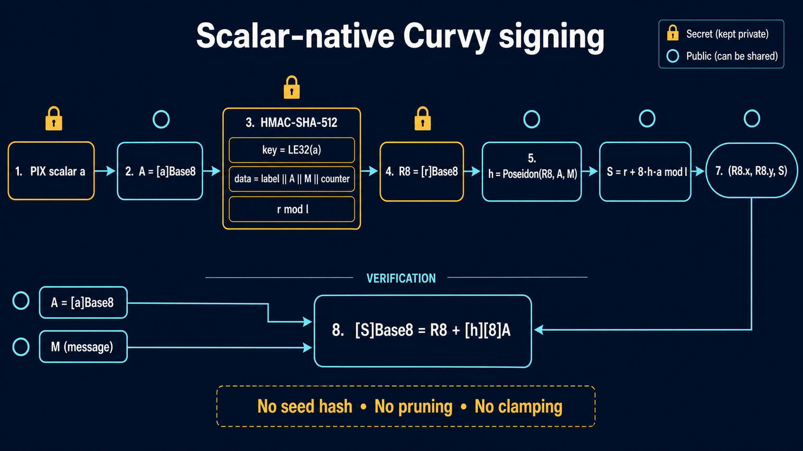
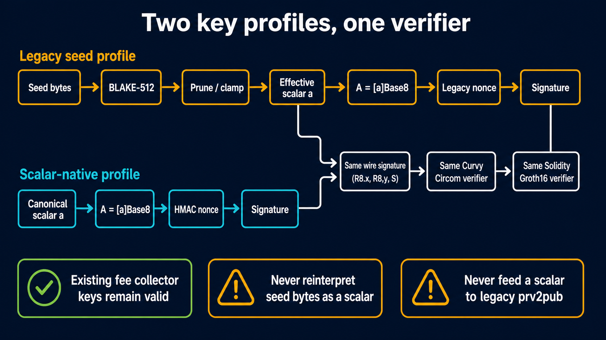
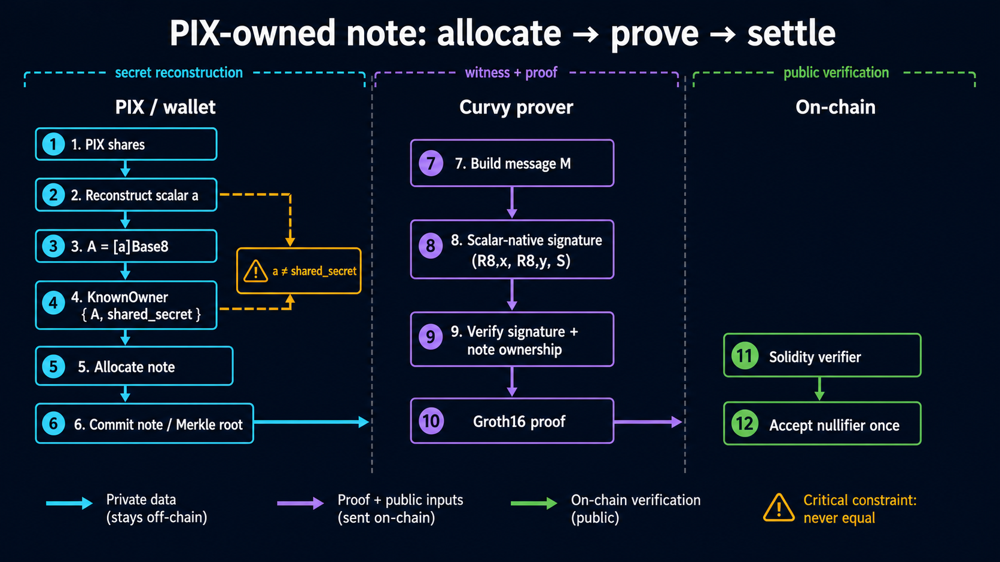

# Proposal: Seedless Scalar-Based BabyJubJub Signatures for Curvy

## Status

Implemented as an evaluation compatibility profile in `curvy-core`,
`curvy-wasm`, and the independent `typescript/` reference package. Production
use still requires replacing the prototype variable-time secret scalar
multiplication and completing the deployed-circuit kill-shot described below.

Protocol identifier:

```text
CURVY_BABYJUB_SCALAR_SIG_V1
```

Implementation map:

- Rust checked types and point derivation: `crates/core/src/babyjubjub.rs`.
- Rust signing and verification: `crates/core/src/eddsa.rs`.
- Signer-based witnesses and `KnownOwner`: `crates/core/src/witness.rs`.
- WASM/JavaScript boundary: `crates/wasm/src/lib.rs`.
- Independent TypeScript reference: `typescript/src/scalar-signature.ts`.
- Shared vector: `crates/core/testdata/scalar_signature_vectors.json`.
- Real pinned withdrawal graph and optional production-zkey gate:
  `sdk/curvy-witnesscalc/tests/scalar_signature.rs`.

Evaluation results:

- Rust and TypeScript reproduce the same deterministic vector.
- `circomlibjs.verifyPoseidon` accepts the signature.
- The generated Rust/WASM exports reproduce the vector.
- The real pinned Curvy withdrawal graph accepts a scalar-native replacement for
  the fixture's seed signature with unchanged public signals.
- The production withdrawal `.zkey` generates and off-chain verifies a Groth16
  proof for that scalar-native witness.

## Visual Overview

The generated visual companion, including the source prompts, is available at
[`diagrams/README.md`](diagrams/README.md).

### Scalar-native signing



The scalar is used directly for public-key derivation and for the response. HMAC
is used only to derive a deterministic nonce; it is not a seed-to-scalar KDF.

### Legacy and scalar-native compatibility



The two key profiles differ only before the signature boundary. Both produce the
same signature representation and are accepted by the existing Curvy circuit and
Groth16 verifier.

### PIX-owned note lifecycle



This view keeps the PIX scalar separate from the note `shared_secret` and shows
where private witness data stops and public proof verification begins.

This proposal defines public-key derivation and signature generation directly
from a canonical BabyJubJub subgroup scalar. It does not hash, prune, clamp, or
otherwise transform seed material into a signing scalar.

The profile is deliberately compatible with Curvy's existing
`EdDSAPoseidonVerifier`, existing Groth16 circuit artifacts, and deployed Solidity
verifiers.

## Scope

This proposal specifies:

- Canonical scalar and field boundaries.
- Direct public-key derivation from a scalar.
- Deterministic nonce generation without an EdDSA seed.
- Scalar-native signature generation.
- Signature verification and validation requirements.
- Rust and TypeScript API shapes.
- Compatibility with the current Curvy Circom and Solidity verifiers.
- A cross-language conformance vector.

This proposal assumes PIX reconstructs the complete signing scalar before
signing. It is not a threshold-signature protocol and must not be independently
applied to individual scalar shares.

This proposal does not define Curvy note `sharedSecret`, allocation, owner-hash,
nullifier, or deposit-handle semantics. Those values remain separate from the
signing scalar.

## Motivation

Curvy's current EdDSA implementation accepts arbitrary private-key bytes as seed
material. It derives the effective signing scalar by:

1. Computing BLAKE-512 over the private-key bytes.
2. Taking and pruning the first 32 digest bytes.
3. Shifting and reducing the pruned integer into the BabyJubJub subgroup.
4. Using the second half of the digest as deterministic nonce material.

PIX reconstructs a scalar that already belongs to the BabyJubJub subgroup scalar
field. There is no secure or practical way to invert Curvy's seed derivation and
find seed bytes that produce the reconstructed scalar.

The required change is therefore a second signing profile whose private input is
the scalar itself.

## Terminology and Parameters

The scalar is private key material. The public key is the BabyJubJub point derived
from it.

The proposal uses the following symbols:

| Symbol | Meaning |
| --- | --- |
| `p` | BN254 field modulus used for BabyJubJub coordinates and Circom signals |
| `l` | BabyJubJub prime subgroup order |
| `Base8` | circomlib BabyJubJub prime-subgroup generator |
| `a` | Canonical non-zero secret scalar reconstructed by PIX |
| `A` | Public key `[a]Base8` |
| `M` | Canonical Curvy signing message in `Bn254Fr` |
| `r` | Deterministic non-zero nonce scalar |
| `R8` | Nonce point `[r]Base8` |
| `h` | Poseidon signature challenge |
| `S` | Signature response scalar |

The subgroup order is:

```text
l = 2736030358979909402780800718157159386076813972158567259200215660948447373041
```

The generator is:

```text
Base8.x = 5299619240641551281634865583518297030282874472190772894086521144482721001553
Base8.y = 16950150798460657717958625567821834550301663161624707787222815936182638968203
```

## Type and Encoding Requirements

Implementations must keep these types distinct:

```text
BabyJubScalar       canonical integer in [0, l)
BabyJubSecretScalar canonical integer in [1, l)
Bn254Fr             canonical integer in [0, p)
BabyJubPoint        checked affine BabyJubJub point
```

`BabyJubSecretScalar` is used for `a` and `r`. The general `BabyJubScalar` is used
for `S`, because zero is a valid canonical signature response even though it is
not a valid private key or nonce.

At every external boundary:

- Scalars must be parsed canonically and must not be silently reduced.
- Secret scalars must reject `0` and values greater than or equal to `l`.
- Signature responses must reject values greater than or equal to `l`.
- Field elements and point coordinates must reject values greater than or equal
  to `p`.
- Decimal and byte encodings must not accept signs, whitespace, truncation, or
  trailing data.

The fixed-width byte encoding used by nonce generation is:

```text
LE32(x) = canonical unsigned 32-byte little-endian encoding of x
```

All values encoded with `LE32` in this proposal are known to fit in 32 bytes.

## Public-Key Derivation

Given a canonical secret scalar `a`:

```text
A = [a]Base8
```

No hash, pruning, clamping, or seed KDF is applied to `a`.

The resulting point is in the prime-order subgroup because `Base8` is the
prime-order subgroup generator and `0 < a < l`.

Implementations must not call circomlibjs `eddsa.prv2pub` for this profile because
that function interprets its input as seed bytes and hashes it. TypeScript should
call `babyJub.mulPointEscalar(babyJub.Base8, a)` directly.

The existing Rust implementation already exposes the underlying operation as
`ephemeral_pub_key`. It should gain a checked API named
`public_key_from_scalar`; the raw unchecked multiplication helper should not be a
protocol boundary.

## Deterministic Nonce Generation

Removing the seed also removes the second half of the seed hash currently used as
nonce-prefix material. The scalar-native profile derives the nonce using
HMAC-SHA-512 keyed by the canonical scalar.

This is still seedless: the scalar is used directly for public-key derivation and
the signature response. HMAC is only a deterministic nonce PRF; it is not a
seed-to-private-scalar derivation.

### Inputs

```text
nonce_label = ASCII("CURVY_BABYJUB_SCALAR_NONCE_V1")
key         = LE32(a)
counter     = 0
```

For each counter value, construct:

```text
data = nonce_label
       || LE32(A.x)
       || LE32(A.y)
       || LE32(M)
       || U32BE(counter)
```

Then compute:

```text
digest = HMAC-SHA-512(key, data)
u      = unsigned little-endian integer represented by digest
limit  = 2^512 - (2^512 mod l)
```

Accept the candidate only when:

```text
u < limit
and
u mod l != 0
```

When accepted:

```text
r = u mod l
```

Otherwise increment `counter` and retry. Counter overflow must return an error,
although reaching it is computationally infeasible.

The `limit` check removes modulo bias. The explicit zero check ensures `R8` is not
the identity.

### Nonce safety requirements

- HMAC must be the standard HMAC construction with SHA-512, not a raw
  `SHA512(key || data)` construction.
- All inputs must use the exact fixed-width encodings above.
- `M` must be canonical before nonce derivation.
- Secret scalar and intermediate nonce buffers must be zeroized where the runtime
  permits it.
- Implementations should verify the completed signature before returning it, to
  detect arithmetic or fault-induced inconsistencies.

An implementation may add a separately versioned hedged-nonce profile in the
future. Unspecified randomness must not be mixed into this v1 derivation because
it would break deterministic cross-language vectors.

## Signature Generation

Given `a`, its public key `A`, and a canonical field message `M`:

1. Derive `r` using the deterministic nonce algorithm.
2. Compute:

   ```text
   R8 = [r]Base8
   ```

3. Compute the existing Curvy/circomlib Poseidon challenge:

   ```text
   h = Poseidon(R8.x, R8.y, A.x, A.y, M)
   ```

4. Compute the response:

   ```text
   S = r + 8*h*a mod l
   ```

5. Return:

   ```text
   Signature {
       R8: BabyJubPoint,
       S:  BabyJubScalar,
   }
   ```

The factor `8` is required for compatibility with Curvy's current Circom verifier.
It must not be omitted and must not be incorporated into public-key derivation.

For implementation efficiency, the response can equivalently use:

```text
e = (8 * (h mod l)) mod l
S = (r + e*a) mod l
```

## Why the Signature Verifies

The existing Curvy circuit verifies:

```text
[S]Base8 = R8 + [h][8]A
```

Substitute `A = [a]Base8`, `R8 = [r]Base8`, and
`S = r + 8*h*a mod l`:

```text
[S]Base8
    = [r + 8*h*a]Base8
    = [r]Base8 + [8*h*a]Base8
    = R8 + [h][8]A
```

The scalar-native signature therefore has the same wire representation and
satisfies the same circuit constraints as the existing seed-derived signature.

## Verification Algorithm

Given public key `A`, message `M`, and signature `(R8, S)`:

1. Canonically parse `M` as `Bn254Fr`.
2. Canonically parse `S` and require `0 <= S < l`.
3. Canonically parse `A` and `R8` without field reduction.
4. Check that `A` and `R8` satisfy the BabyJubJub curve equation.
5. Check that `A` and `R8` belong to the prime-order subgroup.
6. Reject the identity for `A` and `R8`.
7. Compute:

   ```text
   h = Poseidon(R8.x, R8.y, A.x, A.y, M)
   ```

8. Accept only if:

   ```text
   [S]Base8 == R8 + [h][8]A
   ```

Host-side Rust and TypeScript verification must perform all point checks even
while the currently deployed Circom verifier retains its existing constraints.
A hardened circuit should add enabled curve and subgroup checks in a separately
versioned verifier.

## Signature Serialization

The canonical logical representation is a named structure:

```json
{
  "scheme": "CURVY_BABYJUB_SCALAR_SIG_V1",
  "R8": {
    "x": "<canonical decimal>",
    "y": "<canonical decimal>"
  },
  "S": "<canonical decimal>"
}
```

Named fields should be used at API boundaries. Curvy currently has two positional
orders in different layers:

- WASM signing output: `[R8.x, R8.y, S]`.
- Circuit witness signature: `[S, R8.x, R8.y]`.

Adapters must perform this mapping explicitly and test it. Positional arrays must
not be treated as interchangeable.

## Proposed Rust API

The public surface should make it impossible to confuse seed bytes with scalar
key material:

```rust
pub struct BabyJubScalar([u8; 32]);
pub struct BabyJubSecretScalar(Zeroizing<[u8; 32]>);

pub struct BabyJubPoint {
    x: Bn254Fr,
    y: Bn254Fr,
}

pub struct ScalarSigningKey {
    secret: BabyJubSecretScalar,
    public: BabyJubPoint,
}

pub struct ScalarSignature {
    pub r8: BabyJubPoint,
    pub s: BabyJubScalar,
}

impl ScalarSigningKey {
    pub fn from_le_bytes(bytes: [u8; 32]) -> Result<Self, CryptoError>;
    pub fn from_decimal(value: &str) -> Result<Self, CryptoError>;
    pub fn verifying_key(&self) -> &BabyJubPoint;
    pub fn sign_curvy_v1(&self, message: Bn254Fr)
        -> Result<ScalarSignature, CryptoError>;
}

pub fn verify_curvy_scalar_v1(
    public: &BabyJubPoint,
    message: Bn254Fr,
    signature: &ScalarSignature,
) -> Result<(), CryptoError>;
```

The legacy API should remain explicitly seed-named:

```rust
derive_public_key_from_seed(...)
sign_from_seed(...)
```

The scalar API must never call either legacy function internally.

### Witness builder integration

Witness builders should accept a signer instead of an independently provided
private key and public point:

```rust
pub trait NoteSigner {
    fn public_key(&self) -> &BabyJubPoint;
    fn sign(&self, message: Bn254Fr) -> Result<ScalarSignature, CryptoError>;
}
```

Implementations can include:

```text
SeedNoteSigner   legacy Curvy accounts
ScalarNoteSigner PIX-reconstructed scalar accounts
```

This prevents signing with one key while serializing an unrelated public point
into the witness.

### Constant-time requirement

The current Rust `BigUint` double-and-add multiplication branches on secret scalar
bits. It is acceptable for an interoperability prototype but should not be the
production signing backend.

Production code should use:

- Fixed-width scalar storage.
- Constant-time modular addition and multiplication.
- Constant-time fixed-base multiplication for `A` and `R8`.
- No `Debug`, accidental cloning, or serialization on secret-key types.
- Zeroization of scalar and nonce material.
- An internal verify-after-sign check.

The selected constant-time backend and its BabyJubJub parameterization should be
covered by independent vectors before replacing the prototype arithmetic.

## Proposed TypeScript API

TypeScript must expose a scalar-specific API that does not call
`eddsa.prv2pub` or `eddsa.signPoseidon`:

```ts
type ScalarSignature = {
  scheme: "CURVY_BABYJUB_SCALAR_SIG_V1";
  R8: { x: bigint; y: bigint };
  S: bigint;
};

function publicKeyFromBabyJubScalar(a: bigint): BabyJubPoint;

function signWithBabyJubScalar(
  message: bigint,
  a: bigint,
): ScalarSignature;

function verifyBabyJubScalarSignature(
  message: bigint,
  publicKey: BabyJubPoint,
  signature: ScalarSignature,
): boolean;
```

Public-key derivation should use:

```ts
babyJub.mulPointEscalar(babyJub.Base8, a)
```

The signing implementation must reproduce the exact HMAC input layout,
little-endian digest interpretation, rejection sampling, Poseidon challenge, and
cofactor-adjusted response defined above.

## Circom and Solidity Compatibility

The current Circom signature verifier already consumes:

```text
Ax, Ay, R8x, R8y, S, M
```

It has no seed input and performs no BLAKE hashing. Its equation already matches
this proposal. Therefore the scalar-native signing profile does not itself
require:

- A circuit source change.
- A new R1CS.
- A new circuit-specific trusted setup.
- A new `.zkey`.
- A new Solidity Groth16 verifier.

The first deployed-verifier compatibility gate should use the existing artifacts
unchanged.

Adding point-on-curve, subgroup, or transcript-domain constraints is recommended
hardening, but those changes create a new circuit version and require regenerated
Groth16 and Solidity verifier artifacts.

## Message and Domain Separation

For v1 compatibility, `M` remains the exact Curvy message already reconstructed by
the withdrawal or aggregation circuit. The nonce derivation is domain-separated,
but the signature challenge remains the deployed circuit's exact
`Poseidon(R8, A, M)` construction.

Consequently, this proposal does not by itself add chain, contract, operation, or
protocol-profile binding to `M`.

A future circuit profile should define a domain-separated operation message and
signature challenge, for example:

```text
M_v2 = Poseidon(
    DOMAIN_OPERATION,
    chain_id,
    verifier_profile,
    operation_fields_hash
)

h_v2 = Poseidon(
    DOMAIN_SIGNATURE,
    R8.x,
    R8.y,
    A.x,
    A.y,
    M_v2
)
```

That must be a new profile because changing either transcript invalidates the
current circuit and verification key.

## Conformance Vector

The following vector uses the exact algorithms and encodings in this proposal:

```json
{
  "scheme": "CURVY_BABYJUB_SCALAR_SIG_V1",
  "a": "123456789012345678901234567890123456789",
  "M": "424242",
  "A": {
    "x": "1679600532817477986369758545405235521612231758221434728729145760379848501384",
    "y": "2052356072674779384456062308780426538075178505781738512323619445288177659951"
  },
  "nonceCounter": 0,
  "nonceHmacSha512": "8f4243d148f091c5c1684370c4bfe67668e0fe35b3bbcb330e578df9469fbe74fecb38d7435186071b0c1d787b7802d6590aa2577e85a9690ca9d92545470367",
  "r": "191032259456556451718566993943153344409163578624511951912212321164019663779",
  "R8": {
    "x": "15892750900147261210454036921829957609238600602766517456505902462006828830254",
    "y": "4814340545456176148123144630739170444572715854543734014206623433131192208817"
  },
  "h": "13404336863685515831803892786211586853841266788206282671979251356930237019563",
  "S": "323393770092974148543369667815142697564650106543578474793201123360671769728"
}
```

This vector verifies successfully with the installed
`circomlibjs.verifyPoseidon` implementation.

Rust, TypeScript, Circom witness generation, Groth16 proving, and Solidity tests
must reproduce this vector exactly before the profile is accepted.

## Negative Tests

Implementations must include tests that reject:

- Secret scalar `0`.
- Secret scalar `l` or greater.
- A scalar parser that would otherwise reduce modulo `l`.
- A non-canonical message greater than or equal to `p`.
- A non-canonical `S` greater than or equal to `l`.
- Identity, off-curve, non-subgroup, or non-canonical public points.
- Identity, off-curve, non-subgroup, or non-canonical `R8` points.
- A signature created without the factor `8`.
- A signature whose public key does not match the scalar.
- Any change in nonce label, byte order, field width, counter order, or HMAC
  digest interpretation.
- Positional confusion between `[R8.x, R8.y, S]` and `[S, R8.x, R8.y]`.

Tests should also cover `S == 0` if a valid synthetic vector can be constructed,
to ensure parsers distinguish a valid response scalar from an invalid zero secret
scalar.

## Security Considerations

### Scalar/seed separation

Scalar and seed APIs must use different types and different names. Accepting an
untyped byte string and guessing whether it is a seed or scalar is prohibited.

### Nonce reuse

Reusing `r` across different messages reveals the private scalar. The deterministic
HMAC derivation and canonical message encoding are mandatory. Callers must not
supply arbitrary nonce scalars through the public signing API.

### Shared secret separation

The recovered scalar is not Curvy's note `sharedSecret`. Reusing it as the shared
secret would conflate signing and note-privacy domains and is outside this
proposal.

### Distributed shares

If PIX later requires signing without reconstructing `a`, a dedicated threshold
protocol must jointly generate the nonce point and response. Applying this
single-party algorithm independently to shares and adding the results is not
specified and may expose the signing key.

### Side channels

Deterministic nonces remove dependence on RNG quality but do not remove timing,
cache, fault, or memory-disclosure risks. Production scalar and point arithmetic
must be constant time, and reconstructed scalar material should have the shortest
practical in-memory lifetime.

## Rollout Plan

1. Add checked scalar, secret-scalar, field, and point types.
2. Add `public_key_from_scalar` without modifying legacy seed derivation.
3. Implement the deterministic nonce algorithm and conformance vector in Rust.
4. Implement the same vector independently in TypeScript.
5. Add scalar-specific sign and verify APIs.
6. Change witness builders to consume a `NoteSigner` abstraction.
7. Allocate a note to `A = [a]Base8` using an explicitly supplied
   `KnownOwner.shared_secret`.
8. Spend the note through the real Curvy circuit, production proving artifacts,
   and deployed Solidity verifier.
9. Replace prototype variable-time secret arithmetic with the reviewed
   constant-time backend before production use.
10. Introduce circuit point checks and fully domain-separated transcripts in a
    separately versioned hardened profile.

## Acceptance Criteria

This proposal is successful when all of the following hold:

- PIX reconstructs one canonical BabyJubJub subgroup scalar `a`.
- Rust and TypeScript derive the same `A = [a]Base8` without seed hashing.
- Rust and TypeScript reproduce the conformance signature exactly.
- The real Curvy witness accepts the scalar-native signature.
- The Groth16 proof verifies off-chain.
- The deployed Solidity verifier accepts the proof.
- The resulting nullifier is accepted once and rejected on replay.
- No adapter step treats `a` as seed material or as the note `sharedSecret`.
